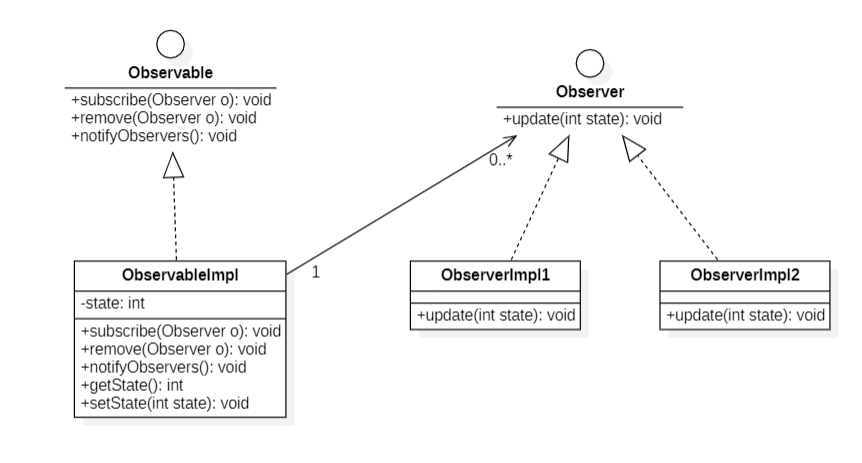
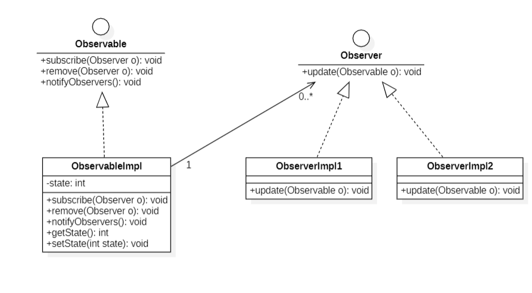

# Patron de Conception : Observer

Le **patron de conception Observer** est un patron de conception comportemental qui définit une relation 
entre des objets de manière à ce que lorsqu'un objet (appelé **Observable**) change d'état,
tous les objets qui dépendent de lui (appelés **observateurs**) soient automatiquement notifiés et mis à jour.
Ce patron est idéal pour implémenter un mécanisme de publication-souscription, où plusieurs objets écoutent
les changements d'un autre.

## Les méthodes **push** et **pull**

Dans l'implémentation du patron Observer, il existe deux stratégies principales pour transmettre 
les informations aux observateurs lorsque le sujet change d'état :

### 1. **Méthode Push**
- **Principe :**
    - L'Observable envoie directement les données aux observateurs lorsqu'un changement d'état survient.
    - Les observateurs reçoivent des informations détaillées, qu'ils peuvent utiliser immédiatement.

- **Avantages :**
    - Les observateurs ne font aucun effort pour obtenir les données, réduisant leur charge de traitement.
    - Idéal lorsque tous les observateurs ont besoin des mêmes informations.

- **Inconvénients :**
    - Peut transmettre trop d'informations à des observateurs qui n'en ont pas besoin.
    - Moins flexible : les observateurs doivent s'attendre à un format précis des données.

- **Diagramme de Classe :**
    

### 2. **Méthode Pull**
- **Principe :**
    - L'Observable notifie ses observateurs d'un changement d'état sans transmettre directement les données.
    - Les observateurs interrogent ensuite L'Observable pour récupérer les informations pertinentes (par exemple, via une méthode `getState()`).

- **Avantages :**
    - Plus flexible : les observateurs choisissent quelles informations consulter.
    - Évite d'envoyer des données inutiles.

- **Inconvénients :**
    - Augmente le couplage : les observateurs doivent connaître l'interface du sujet.
    - Peut entraîner des allers-retours inutiles entre L'Observable et les observateurs.

- **Diagramme de Classe :**
    

## Différences clés entre Push et Pull

| **Critères**         | **Méthode Push**                            | **Méthode Pull**                            |
|----------------------|--------------------------------------------|--------------------------------------------|
| **Transmission de données** | Les données sont envoyées automatiquement.  | Les données sont demandées par l'observateur. |
| **Couplage**         | Faible : les observateurs reçoivent tout ce qui est nécessaire. | Plus fort : les observateurs doivent connaître l'interface du sujet. |
| **Flexibilité**      | Moins flexible : format imposé des données.   | Plus flexible : chaque observateur choisit ce qu'il interroge. |
| **Efficacité**       | Peut être inefficace si trop de données sont envoyées. | Peut être inefficace si trop d'allers-retours. |

## Conclusion
Le choix entre la méthode **push** et **pull** dépend des besoins :
- Utilisez **push** si les observateurs ont besoin immédiatement des mêmes données.
- Utilisez **pull** si les observateurs doivent choisir quelles informations consulter ou si la flexibilité est cruciale.